## Open CTI and How to Build Softphone

This document is for the Computer Telephony Providers planning to use Open CTI to integrate with Salesforce

Note: 

If you like to see how to setup Amazon Connect using OpenCTI click [here](./ac.md)


### Demo: Let us setup the call center and softphone

CTI Adapter URL used in this demo : [CTI Adapter URL](https://mohan-sundar-bp.herokuapp.com/opencti/softphone.html)
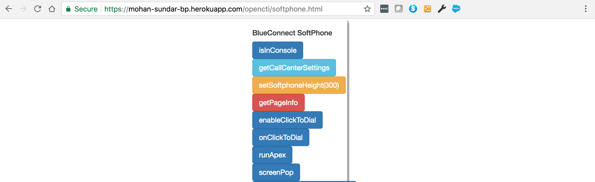

**Demo**


### Details

**Softphone ready**
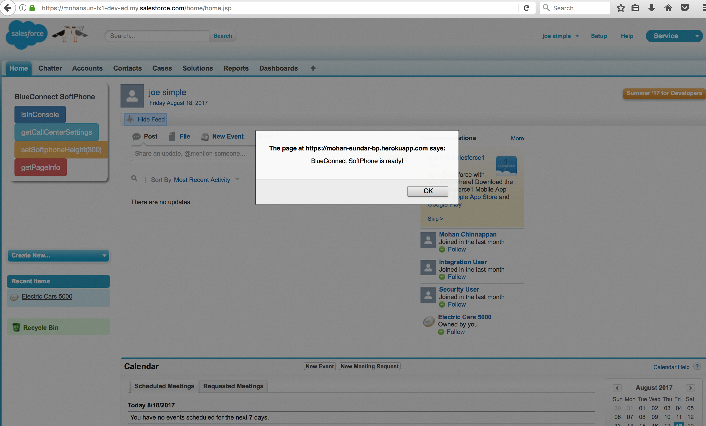

#### Running Apex

**Create Apex Class**
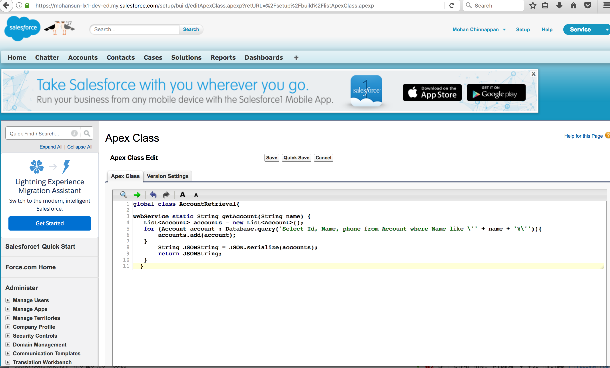
**Create Generate WSDL**
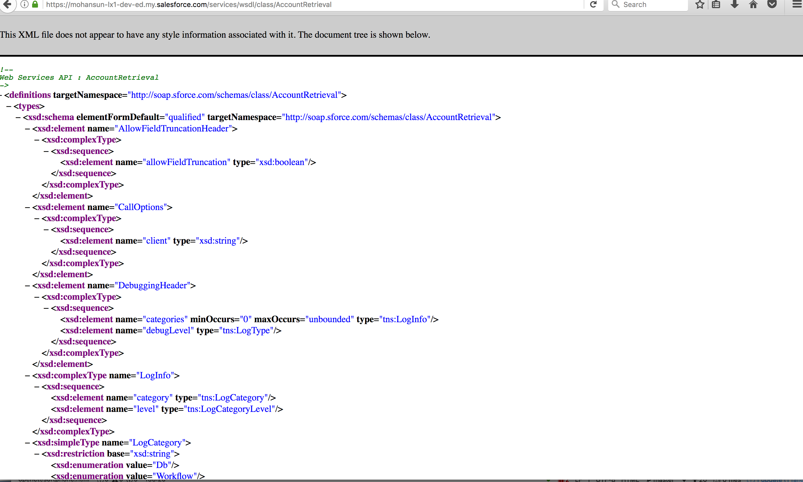
**Run Apex from Softphone**
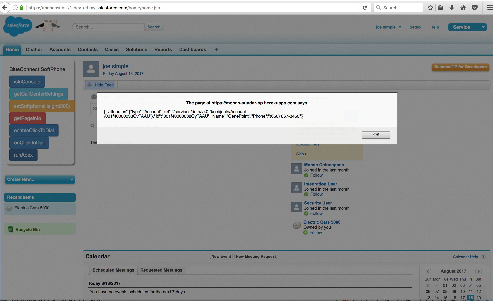

#### Screen Pop
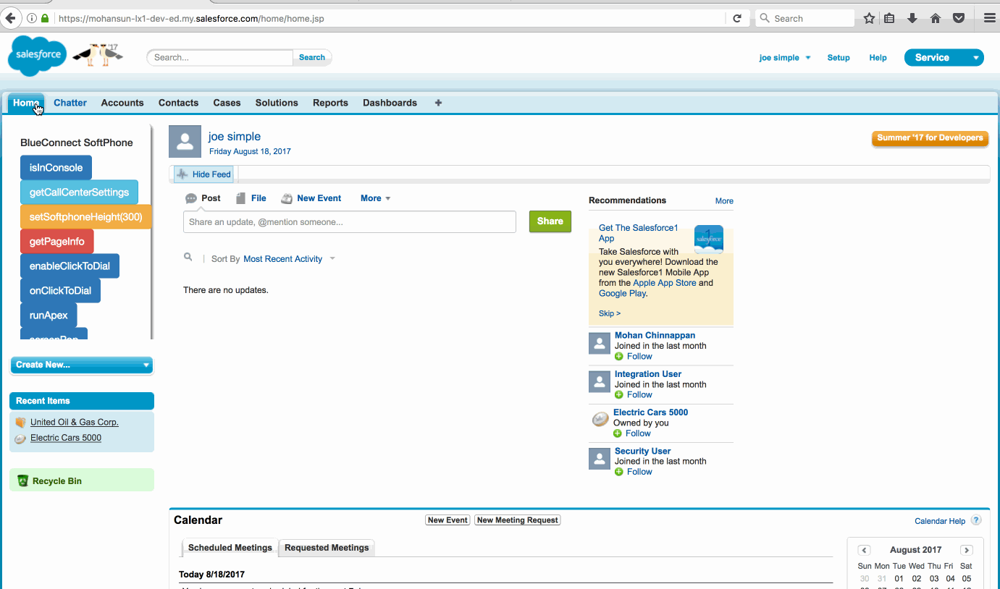

#### Search and Get ScreenPopUrl
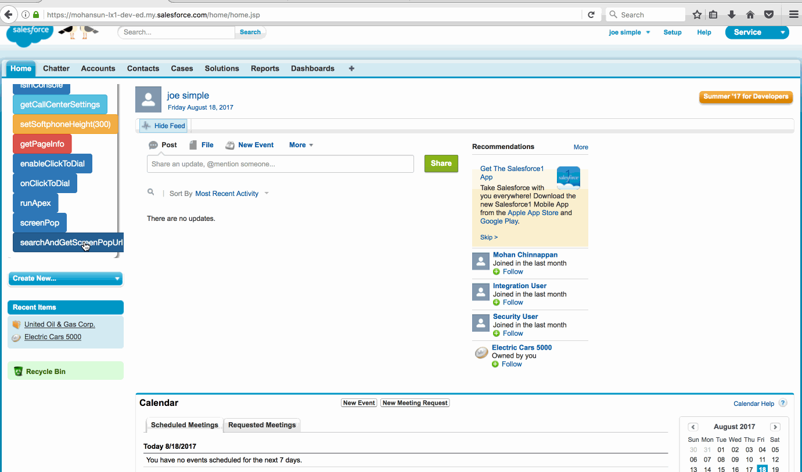


Ref:

[Open CTI Developer Guide](https://developer.salesforce.com/docs/atlas.en-us.api_cti.meta/api_cti/sforce_api_cti_intro.htm)


## Open CTI Details

What is Open CTI ?

Build and integrate third-party computer-telephony integration (CTI) systems with **Salesforce Call Center** using a **browser-based JavaScript API**.


Browser is used as clients (instead of desktop fat-clients)

With Open CTI:

1. you can make calls from a **softphone directly** in Salesforce without installing CTI adapters on your machines. 

2. Create customizable softphones (call-control tools) that function as fully integrated parts of Salesforce and the Salesforce console.

3. Provide users with CTI systems that are browser and platform agnostic


**What is Desktop CTI (aka CTI Toolkit)?**

Desktop CTI, also known as the CTI Toolkit, is the predecessor to Open CTI. Desktop CTI required adapters to be installed on **each call center user’s machine**. 

With Open CTI, those user-side adapters are a **thing of the past**.

Desktop CTI is **retired** and you must **migrate** to Open CTI. Work with your partners to create an Open CTI implementation.


**What is  Salesforce Voice ?**

Salesforce Voice provides a way to provision numbers and make calls directly from Salesforce. 

However, if you already have **a telephony system in place**, Open CTI is the way to go since it **integrates to that existing system**.


 If your organization may have complex business processes that are **unsupported by Open CTI** functionality:
 
 You can use Force.com platform to implement custom functionality
 
 1. SOAP API
 2. Visualforce
 3. Console API
 4. Apex


**Versions**

Open CTI matches the API version for any given release. For example, if the current version of **SOAP API** is 40.0, then there’s also a version 40.0 of Open CTI.


### Open CTI Capabilities  :

- Set the height or width of a softphone
- Enable or disable **click-to-dial**
- Return a call center definition file’s settings
- Determine if a user is in the Salesforce console
- Show or hide a softphone in the Salesforce console
- Return information about a page
- Execute an Apex method from an Apex class that’s exposed in Salesforce
- Save or update an object in Salesforce
- Search keywords in Salesforce and screen pop any matching records as defined in a softphone layout


#### UI

Separate Open CTI APIs for **Salesforce Classic** and **Lightning Experience**.

In Salesforce Classic

- If you want to make calls using a **softphone in Salesforce Classic**
- You want to make calls using a **softphone in a Salesforce Classic console app**


```
// script:
/support/api/40.0/interaction.js

// method call example
sampleMethod(var1,var2…)


```

In Lightning Experience

- You want to make calls using a softphone in **Lightning Experience**
- You want to make calls using a softphone in a **Lightning Experience console app**


```

// script:
/support/api/40.0/lightning/opencti_min.js

// method call example
sampleMethod({
	arg1 : value1,
	arg2 : value2,
	...
})


```


### Setup

1. Create a Lightning app 
2. add the Open CTI Softphone to your utility bar
3. In the call center definition file:
     the ``` reqSalesforceCompatibilityMode ``` item must be set to ```Lightning or Classic_and_Lightning```.


### Salesforce Call Center
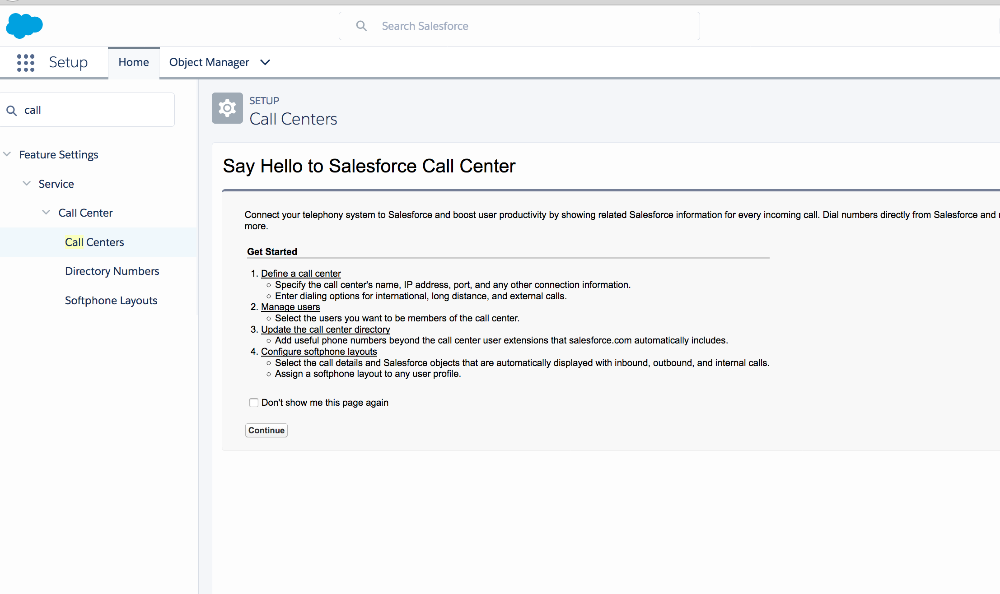

How to Get Started:

  1.  Define a call center
        Specify the call center's name, IP address, port, and any other connection information.
  
 2.   Enter dialing options for international, long distance, and external calls.
    Manage users
        Select the users you want to be members of the call center.
 3. Update the call center directory
        Add useful phone numbers beyond the call center user extensions that salesforce.com automatically includes.
        
 4. Configure softphone layouts
        Select the call details and **Salesforce objects that are automatically displayed with inbound, outbound, and internal calls**.
        Assign a softphone layout to any user profile.
        
        

What is Salesforce Call Center?

A call center corresponds to a **single** computer-telephony integration (CTI) system already in place at your organization. 

Salesforce.com **users** must be **assigned** to a **call center** before they can use any Call Center features.


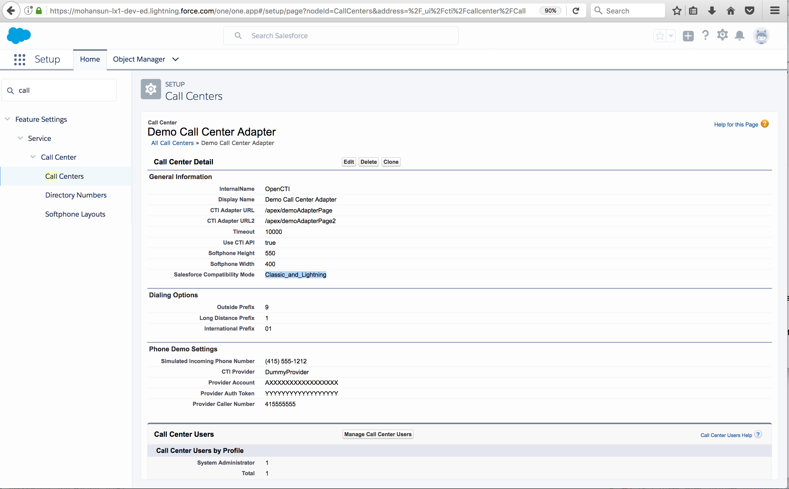

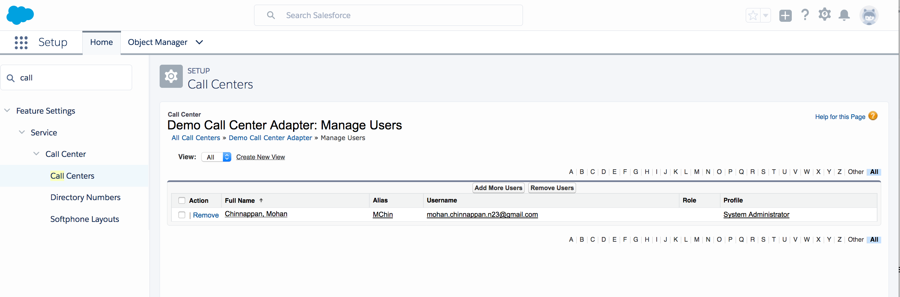


Note:

If you want your Open CTI implementation to work in **Lightning Experience** and in a **console in Salesforce Classic**, develop a **unique implementation** that uses both Open CTI for Salesforce Classic and Lightning Experience.


Methods:

***Same/similar in - Classic and LX***

1. ```enableClickToDial()```
2. ```disableClickToDial()```
3. ```onClickToDial()```
4. ```getCallCenterSettings()```
5. ```getPageInfo()```
6. ```getSoftphoneLayout()```
7. ```isVisible()```  in  lx: ```isSoftphonePanelVisible()```
8. ```onFocus()```    in  lx: ```onNavigationChange()```
9. ```refreshPage()``` in lx: ```refreshView()```
10. ```refreshRelatedList()``` in lx ```refreshView()```
11. ```reloadFrame()``` in lx: ```refreshView()```
12. ```runApex()```
13. ```saveLog()```
14. ```screenPop()```
15. ```searchAndScreenPop()```
16. ```setSoftphoneHeight()``` in lx: ```setSoftphonePanelHeight()```
17. ```setSoftphoneWidth()```  in lx: ```setSoftphonePanelWidth()```
18. ```setVisible()``` in lx: ```setSoftphonePanelVisibility()```

***Different in - Classic and LX***

1. ```searchAndGetScreenPopUrl()``` in lx: use ```searchAndScreenPop()```
2. ```isInConsole()``` in lx: NA
3. ```getDirectoryNumbers()	``` in lx: NA


### Call Center Definition Files

- specifies a set of fields and values that are used to define a call center in Salesforce for a particular softphone

- Salesforce uses call center definition files to support the integration of Salesforce CRM Call Center with **multiple CTI system vendors**.

- If you build a custom softphone with Open CTI, you must write a call center definition file to support it. 


#### Sample Call Center Definition file for Classic

```xml


<!-- 
    callCenter:

   definition for a single call center phone system 
   At least one <CallCenter> element must be included in every call center definition file

-->


<callCenter>

 <!--
     section:
     
        Represents a grouping of related data fields:
       such as server information or dialing prefixes. 
       
     Consists of one or more <item> elements.
     When a call center is edited in Salesforce, fields are organized by the section to which they are assigned.
    
    -->

   <section sortOrder="0" name="reqGeneralInfo" label="General Information">
   
     <!--
     item:
     single field in a call center definition, such as the IP address of a primary server or the dialing prefix for international calls
     
      -->
    
      <!--
             label: The name of the item when viewed in Salesforce
             
             name: The internal name of the item as defined in the Salesforce database.
             if the name starts with 'req' it is a required item
            
      -->
    
    <item sortOrder="0" name="reqInternalName" label="InternalName">DemoAdapter</item>
    <item sortOrder="1" name="reqDisplayName" label="Display Name">Demo Call Center Adapter</item>
    
     <!--
            reqAdapterUrl:
            
	            Represents the location of where the CTI adapter or softphone is hosted. 				For example:
					http://localhost:11000
				
				Relative URLs are allowed for Visualforce pages. For example:
				: /apex/softphone
				
				If you add Force.com Canvas applications to Open CTI, those apps can trump reqAdapterUrl when specified.
				
				To implement in a Lightning Experience org, use https in your URL.
				
       -->
            
    <item sortOrder="2" name="reqAdapterUrl" label="CTI Adapter URL">https://mohan-sundar-bp.herokuapp.com/opencti/softphone.html</item>
    <item sortOrder="3" name="reqUseApi" label="Use CTI API">true</item>
    <item sortOrder="4" name="reqSoftphoneHeight" label="Softphone Height">300</item>
    <item sortOrder="5" name="reqSoftphoneWidth" label="Softphone Width">500</item>
    <item sortOrder="6" name="reqSalesforceCompatabilityMode" label=" Salesforce Compatibility Mode">Classic</item>
   </section>
   <section sortOrder="1" name="reqDialingOptions" label="Dialing Options">
    <item sortOrder="0" name="reqOutsidePrefix" label="Outside Prefix">9</item>
    <item sortOrder="1" name="reqLongDistPrefix" label="Long Distance Prefix">1</item>
    <item sortOrder="2" name="reqInternationalPrefix" label="International Prefix">01</item>
   </section>
</callCenter>

```


#### Sample Call Center Definition file for LX

```xml
<callCenter>
   <section sortOrder="0" name="reqGeneralInfo" label="General Information">
    <item sortOrder="0" name="reqInternalName" label="InternalName">OpenCTI</item>
    <item sortOrder="1" name="reqDisplayName" label="Display Name">OpenCTI</item>
    <item sortOrder="2" name="reqAdapterUrl" label="CTI Adapter URL">https://domain:port/softphone</item>
    <item sortOrder="3" name="reqUseApi" label="Use CTI API">true</item>
    <item sortOrder="4" name="reqSoftphoneHeight" label="Softphone Height">300</item>
    <item sortOrder="5" name="reqSoftphoneWidth" label="Softphone Width">500</item>
    <item sortOrder="6" name="reqSalesforceCompatibilityMode" label="Salesforce Compatibility Mode">Lightning</item>
   </section>
   <section sortOrder="1" name="reqDialingOptions" label="Dialing Options">
    <item sortOrder="0" name="reqOutsidePrefix" label="Outside Prefix">9</item>
    <item sortOrder="1" name="reqLongDistPrefix" label="Long Distance Prefix">1</item>
    <item sortOrder="2" name="reqInternationalPrefix" label="International Prefix">01</item>
   </section>
</callCenter>

```


### How to connect to Open CTI

Any JavaScript code that uses the Open CTI must make the toolkit available to the JavaScript code.  Here is how:

#### Classic (For Visualforce Pages)

```xml
<apex:page>
          <script src="/support/api/40.0/interaction.js" type="text/javascript"></script>
     
</apex:page>
```

#### LX (For Visualforce Pages)
```xml

<apex:page>
    <script src="/support/api/40.0/lightning/opencti_min.js" type="text/javascript"></script>
     
</apex:page>
```


### Open CTI and Security

We recommend that all Open CTI implementations use HTTPS in the reqAdapterUrl element in their call center definition file. Using HTTPS ensures that traffic between your telephony server and Salesforce is encrypted.

By using HTTPS, Open CTI inherits all the benefits of browser and cloud-based security because it points directly to the **softphone provider using a secure connection**.

When users access the softphone on any Salesforce page, it’s displayed in an **iFrame** and all messages from the softphone to Salesforce are sent via **Window.postMessage()** methods. For each message sent, the target is restricted to Salesforce. For each message received, Salesforce verifies its format and the sender origin.


#### Softphone iframe

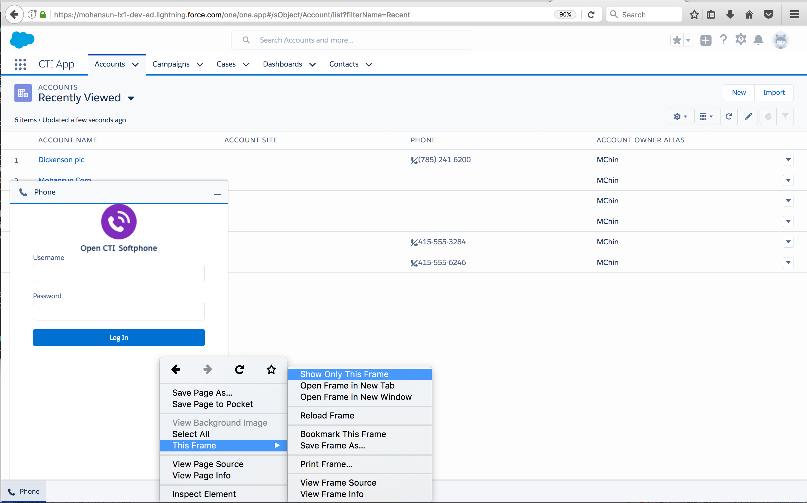

Viewed softphone iframe
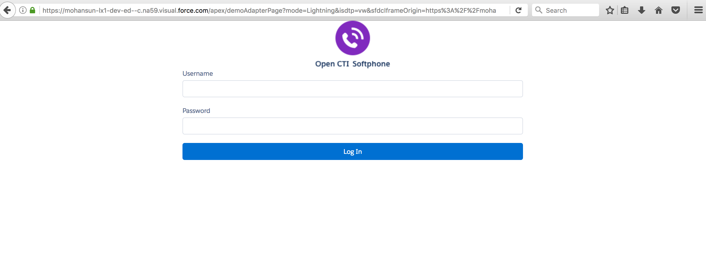

HTML markup showing the iframe

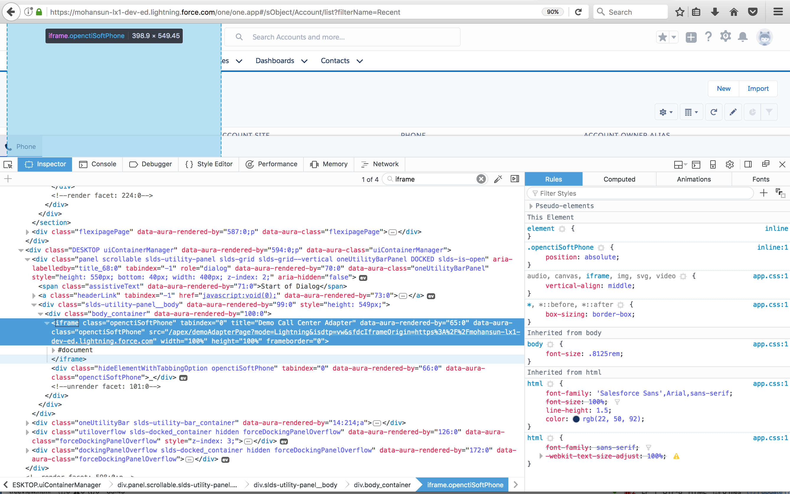

#### About window.postMessage() 

The window.postMessage() method safely enables **cross-origin communication**. 
Normally, scripts on different pages are allowed to access each other if and only if the pages that executed them are at locations with the same protocol(https).
window.postMessage() provides a controlled mechanism to circumvent this restriction in a way which is secure when properly used.

How it works:

when called, causes a **MessageEvent* to be dispatched at the target window when any pending script that must be executed completes (e.g., remaining event handlers if window.postMessage() is called from an event handler, previously-set pending timeouts, etc.) 

The MessageEvent has the type message, a data property which is set to the value of the first argument provided to window.postMessage(), an origin property corresponding to the origin of the main document in the window calling window.postMessage at the time window.postMessage() was called, and a source property which is the window from which window.postMessage() is called. (Other standard properties of events are present with their expected values.)


#### Demo of window.postMessage()

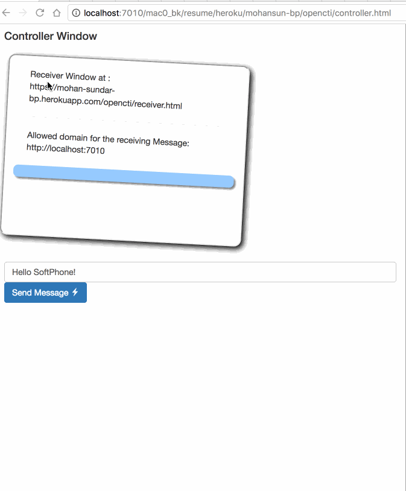

**window.postMessage**

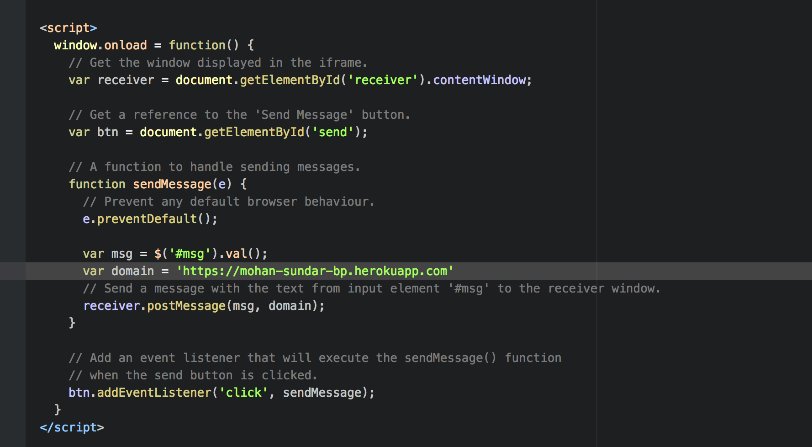


**window.postMessage in openCTI - interaction.js**

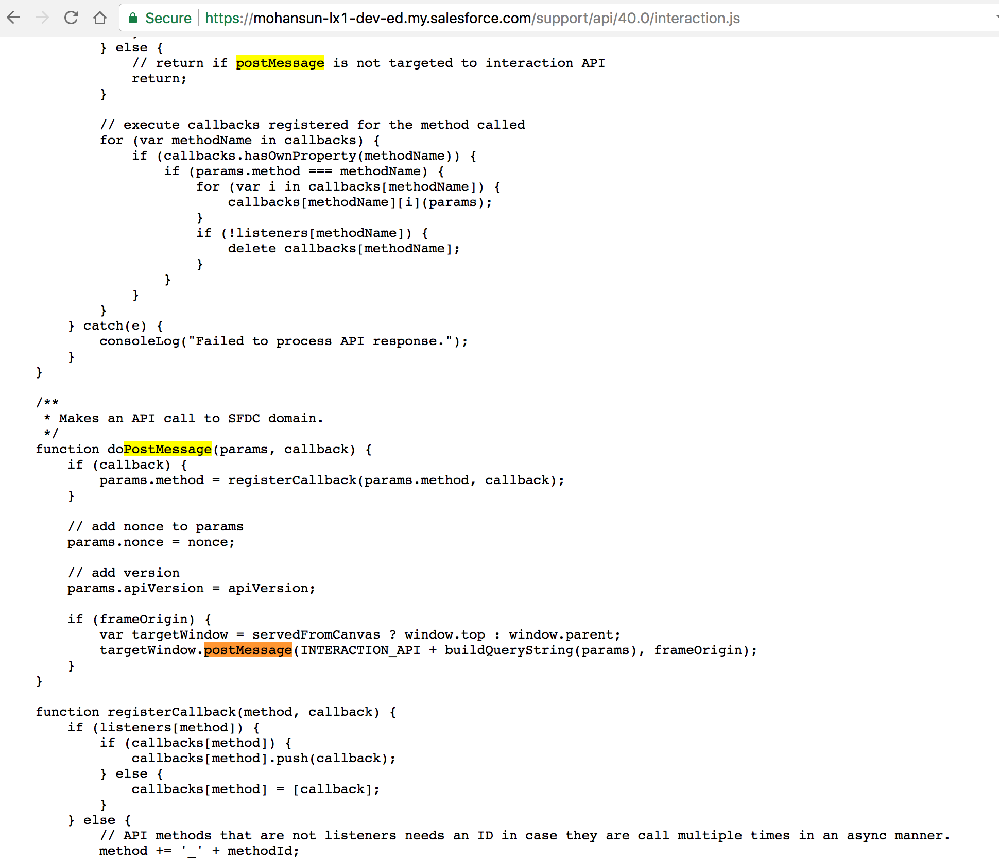

**Ref**
1. [MDN](https://developer.mozilla.org/en-US/docs/Web/API/Window/postMessage)
2. [Cross-Domain Messaging With postMessage](http://blog.teamtreehouse.com/cross-domain-messaging-with-postmessage)


### Asynchronous Calls with Open CTI

#### Classic
```javascript
   //Set softphone height
   sforce.interaction.cti.setSoftphoneHeight(300, callback);
```

#### LX
```javascript
//Disable clickToDial
sforce.opencti.disableClickToDial({callback: callback});

```

### Sample HTML Page using Open CTI

#### Classic

[Link](https://mohan-sundar-bp.herokuapp.com/opencti/softphone.html)

```html
<!DOCTYPE html>
<html lang="en">

<head>
  <meta charset="UTF-8">
  <meta name="viewport" content="width=device-width, initial-scale=1.0">
  <meta http-equiv="X-UA-Compatible" content="ie=edge">
  <title>BlueConnect Softphone</title>
  <script src="https://cdnjs.cloudflare.com/ajax/libs/jquery/3.2.1/jquery.min.js"></script>

  <link href="https://maxcdn.bootstrapcdn.com/bootstrap/3.3.7/css/bootstrap.min.css" rel="stylesheet" integrity="sha384-BVYiiSIFeK1dGmJRAkycuHAHRg32OmUcww7on3RYdg4Va+PmSTsz/K68vbdEjh4u" crossorigin="anonymous">

  <script src="https://maxcdn.bootstrapcdn.com/bootstrap/3.3.7/js/bootstrap.min.js" integrity="sha384-Tc5IQib027qvyjSMfHjOMaLkfuWVxZxUPnCJA7l2mCWNIpG9mGCD8wGNIcPD7Txa" crossorigin="anonymous">
  </script>


  <!-- Imports Open CTI JavaScript library. Point to a valid Salesforce domain. -->
  <script src="https://mohansun-lx1-dev-ed.my.salesforce.com/support/api/40.0/interaction.js"></script>
  <script src="https://cdnjs.cloudflare.com/ajax/libs/jqueryui/1.12.1/jquery-ui.min.js"></script>
  <link rel="stylesheet" href="https://cdnjs.cloudflare.com/ajax/libs/jqueryui/1.12.1/jquery-ui.min.css" />

  <script type="text/javascript">
    $(document).ready(function() {
      window.old_alert = window.alert;

      window.alert = function(message, fallback) {
        if (!fallback) {
          old_alert(message);
          return;
        }
        $(document.createElement('div'))
          .attr({
            title: 'Alert',
            'class': 'alert'
          })
          .html(message)
          .dialog({
            buttons: {
              OK: function() {
                $(this).dialog('close');
              }
            },
            close: function() {
              $(this).remove();
            },
            draggable: true,
            modal: true,
            resizable: false,
            width: 'auto'
          });
      };

      //alert('BlueConnect SoftPhone is ready!');
    });


    // Callback of API method: isInConsole
    var isInConsoleCallback = function(response) {
      // Returns true if method is executed in Salesforce console, false otherwise.
      console.log('response: ' + response);
      if (response.result) {
        var msg = 'Softphone is in Salesforce console.'
        alert(msg);
        console.log(msg);
      } else {
        alert('Softphone is not in Salesforce console.');
      }
    };
    // Invokes API method: isInConsole
    function isInConsole() {
      console.log('in:isInConsole');
      sforce.interaction.isInConsole(isInConsoleCallback);
    }
    // Callback of API method: getCallCenterSettings
    var getCallCenterSettingsCallback = function(response) {
      // Result returns call center settings as a JSON string.
      if (response.result) {
        alert(JSON.stringify(response.result, null, 4));
      } else {
        alert('Error retrieving call center settings ' + response.error);
      }
    };
    // Invokes API method: getCallCenterSettings
    function getCallCenterSettings() {
      sforce.interaction.cti.getCallCenterSettings(getCallCenterSettingsCallback);
    }
    // Callback of API method: setSoftphoneHeight
    var setSoftphoneHeightCallback = function(response) {
      // Returns true if SoftPhone height was set successfully, false otherwise.
      if (response.result) {
        alert('Setting softphone height to 300px was successful.');
      } else {
        alert('Setting softphone height failed.');
      }
    };
    // Invokes setSoftphoneHeight API method.
    function setSoftphoneHeight() {
      sforce.interaction.cti.setSoftphoneHeight(300, setSoftphoneHeightCallback);
    }
    // Callback of API method: getPageInfo
    var getPageInfoCallback = function(response) {
      if (response.result) {
        alert(response.result);
      } else {
        alert('Error occured while trying to get page info: ' + response.error);
      }
    }
    // Invokes API method getPageInfo
    function getPageInfo() {
      sforce.interaction.getPageInfo(getPageInfoCallback);
    }


    function runApex() {
      //Invokes API method
      sforce.interaction.runApex('AccountRetrieval', 'getAccount', 'name=GenePoint', function(response) {
        if (response.result) {
          alert(response.result);
        } else {
          alert(response.error);
        }
      });
    }


    function screenPop(id) {
      //Invokes API method
      sforce.interaction.screenPop('/' + id, true, function(response) {
        if (response.result) {
          alert('Screen pop was set successfully.');
        } else {
          alert('Screen pop failed.' + result.error);
        }
      });
    }


    function enableClickToDial() {
      sforce.interaction.cti.enableClickToDial(function(response) {
        if (response.result) {
          alert('Click to dial was enabled.');
        } else {
          alert('Click to dial was not enabled.');
        }
      });
    }


    function onClickToDial() {
      sforce.interaction.cti.onClickToDial(function(response) {
        if (response.result) {
          alert('User clicked on a phone number.' + response.result);
        }
      });
    }

    function searchAndGetScreenPopUrl(term) {
      //Invokes API method
      sforce.interaction.searchAndGetScreenPopUrl(term, 'Key1=value1&Key2=value2', 'inbound', function(response) {
        if (response.result) {
          alert(response.result);
        } else {
          alert(response.error);
        }
      });
    }

  </script>
  <style>
    .box {
      border-radius: 8px;
      padding: 10px;
      box-shadow: 3px 3px 3px #888888;
      width: 190px;
    }

    .alert {
      font-size: 1.3em;
      padding: 1em;
      text-align: center;
      white-space: nowrap;
      width: auto;
      word-wrap: normal;
    }
  </style>

</head>

<body>
  <div class='container box'>
    <h5>BlueConnect SoftPhone</h5>
    <button class='btn btn-primary' onclick="isInConsole();">isInConsole</button><br/>
    <button class='btn btn-info' onclick="getCallCenterSettings();">getCallCenterSettings</button><br/>
    <button class='btn btn-warning' onclick="setSoftphoneHeight();">setSoftphoneHeight(300)</button><br/>
    <button class='btn btn-danger' onclick="getPageInfo();">getPageInfo</button>
    <button class='btn btn-primary' onclick="enableClickToDial();">enableClickToDial</button>
    <button class='btn btn-primary' onclick="onClickToDial();">onClickToDial</button>
    <button class='btn btn-primary' onclick="runApex();">runApex</button>
    <button class='btn btn-primary' onclick="screenPop('001f40000038OyO');">screenPop</button>
    <button class='btn btn-primary' onclick="searchAndGetScreenPopUrl('United Oil & Gas Corp.')">searchAndGetScreenPopUrl</button>
</body>

</html>


```
 
#### LX
```html
<apex:page >
  <!-- Begin Default Content -->
  <h1>Congratulations!</h1>
  This is your sample page.
  <!-- End Default Content -->
<html>
<head>
   <!-- Imports Open CTI JavaScript library. Point to a valid Salesforce domain.
-->
   <script src="https://domain:port/support/api/40.0/opencti_min.js"></script>
   <script type="text/javascript">
      // Callback of API method: setSoftphonePanelHeight
      var setSoftphonePanelHeightCallback = function(response) {
            // Returns true if setSoftphonePanelHeight method is executed successfully, false otherwise
            if (response.result) {
               alert('setSoftphonePanelHeight is successfully executed.');
            } 
            else {
               alert('setSoftphonePanelHeight failed.');
            }
      };
      // Invokes API method: setSoftphonePanelHeight
      function setSoftphonePanelHeight() {
         sforce.opencti.setSoftphonePanelHeight({
            heightPX: 500,
            callback: setSoftphonePanelHeightCallback
         });
      }
      // Callback of API method: setSoftphonePanelWidth
      var setSoftphonePanelWidthCallback = function(response) {
            // Returns true if setSoftphonePanelWidth method is executed successfully, false otherwise
            if (response.result) {
               alert('setSoftphonePanelWidth is successfully executed.');
            } 
            else {
               alert('setSoftphonePanelWidth failed.');
            }
      };
      // Invokes API method: setSoftphonePanelWidth
      function setSoftphonePanelWidth() {
         sforce.opencti.setSoftphonePanelWidth({
            widthPX: 500,
            callback: setSoftphonePanelHeightCallback
         });
      }
      // Callback of API method: setSoftphoneItemIcon
      var setSoftphoneItemIconCallback = function(response) {
            // Returns true if setSoftphoneItemIcon method is executed successfully, false otherwise
            if (response.result) {
               alert('setSoftphoneItemIcon is successfully executed.');
            } 
            else {
               alert('setSoftphoneItemIcon failed.');
            }
      };
      // Invokes API method: setSoftphoneItemIcon
      function setSoftphoneItemIcon() {
         sforce.opencti.setSoftphoneItemIcon({
            key: 'call',
            callback: setSoftphoneItemIconCallback
         });
      }
      // Callback of API method: setSoftphoneItemLabel
      var setSoftphoneItemLabelCallback = function(response) {
            // Returns true if setSoftphoneItemLabel method is executed successfully, false otherwise
            if (response.result) {
               alert('setSoftphoneItemLabel is successfully executed.');
            } 
            else {
               alert('setSoftphoneItemLabel failed.');
            }
      };
      // Invokes API method: setSoftphoneItemLabel
      function setSoftphoneItemLabel() {
         sforce.opencti.setSoftphoneItemLabel({
            Label: 'MySoftphone',
            callback: setSoftphoneItemLabelCallback
         });
      }
   </script>
</head>
<body>
   <button onclick="setSoftphonePanelHeight();">setSoftphonePanelHeight({heightPX:500})</button><br/>
   <button onclick="setSoftphonePanelWidth();">setSoftphonePanelWidth({widthPX:500})</button><br/>
   <button onclick="setSoftphoneItemIcon();">setSoftphoneItemIcon({key:'call'})</button><br/>
   <button onclick="setSoftphoneItemLabel();">setSoftphoneItemLabel({label:'MySoftphone'})</button>
</body>
</html>
</apex:page>
```


Ref: [about window.postMessage()](https://developer.mozilla.org/en-US/docs/Web/API/Window/postMessage) 


#### Open CTI Lightning Demo Adapter
This CTI demo adapter package lets you test drive Open CTI for Lightning Experience. The package provides a demo softphone that highlights and demonstrates the main features of Open CTI for Lightning Experience without even connecting to a phone system.

[Lightning Open CTI](https://developer.salesforce.com/page/Lightning_Open_CTI)
[open cti demo adapter](https://github.com/developerforce/open-cti-demo-adapter)


----

#### Amazon connect notes:

[Amazon Connect Notes](./ac.md)

----- 

### IVR, ACD, Auto-Attendant, Voicemail. What’s The Difference?


**IVR – Interactive Voice Response**
Interactive Voice Response (IVR) is a technology that allows a computer to interact with humans using voice commands or tones from a telephone keypad (DTMF, or Dual Tone Multifrequency, the beeps your phone makes when you dial). Technically, IVR lets the caller enter an “ID” or account code, then provides access to a database. This is where the “interactive” part comes in. Banks and Credit Unions often have “phone bank” systems that allow you to conduct transactions. This is IVR.


**ACD — Automatic Call Distribution**
ACD Systems answer incoming calls and allow the caller to choose a menu, group of extensions or singular extension to which the call is routed. The term is used in large call centers to describe the system of organizing incoming calls into queues of callers waiting to speak with an operator or service person.

**Automated Attendant**
The term Automated attendant is essentially the same as ACD. The incoming call is answered automatically, then allows callers to choose where the call is routed. Automated Attendant is also called Auto-Attendant, AA or Virtual Receptionist. Typically a simple menu such as, “press 1 to speak with our parts department, press 2 for directions to our store…” is offered. Callers can be routed to an extension, an outside line or a recording. Some Auto Attendant Systems are a part of a business phone system, while many are “add-on” systems (sometimes part of the Voicemail System).

**Voicemail**
A Voicemail System is designed specifically for recording a message from the caller’s voice (leaving a message for the intended party). Voicemail Systems can be operated by simple devices such as answering machines, remotely operated as with your cell phone voicemail, or added to a business phone system. Examples are Nortel Call Pilot, Star Flash and various systems by Avaya, Cisco, 3com, Mitel and others. Such systems are often “add-ons” to a PBX system As more businesses move into I.P. telephony (hosted PBX solutions), Voicemail is likely part of a Unified Messaging System, which can combine cell phone, email, voicemail and other types of messaging.

**CCR Tree**
A Custom Call Routing (CCR) Tree refers to the part of a Voicemail, IVR or Automated Attendant system that designates the departments and extensions to which callers are routed. Callers are prompted at each stage in the routing process by a recorded voice. CCR Trees can contain multiple menus and sub-menus to allow callers to obtain more specific information. Often, business callers complain about being “trapped in a call center loop” or “voicemail hell”. This is what happens when a CCR Tree is not well planned. Frequently-used pathways should be considered, as well as the length of voiced prompts. 

  
***Tips***

If you are considering setting up a voice response or voicemail system for your company, here are a few tips to consider:

Consider the length of each message (callers can be impatient).
Use consistent language (all department and extension names must be accurate in every menu).
Take time to write out every word that you want callers to hear. Test it by speaking it aloud.
Talk to your I.T. or telephony consultant to be sure you understand time/memory limits your system may have.
Discuss call routing architecture with the equipment provider as well as your tech and marketing teams.
Consider using professional voice talent with experience in voicemail and IVR recording. Your callers will notice the difference.


Ref:

[IVR, ACD](http://easyonhold.com/blog/ivr-acd-auto-attendant-voicemail-whats-the-difference/)


	


 


